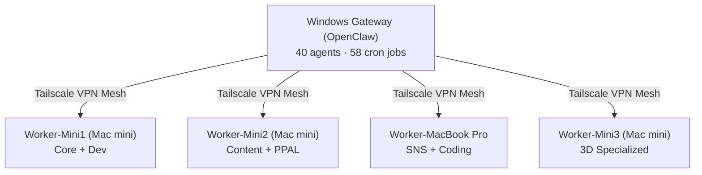

🌐 **English** | 🇯🇵 **[日本語](./README_ja.md)**

---

## My Story

**2024** — Started with a single prompt. No engineering degree. Just a laptop and curiosity.

**2025** — Built 40 autonomous AI agents across 5 machines. They write code, manage communities, create content, and run business operations — 24 hours a day, 7 days a week.

**2026 April** — Founding **Miyabi AI LLC** in Aichi, Japan. One human. 40 AI agents. Running a real company.

> *"I don't code. I architect systems where AI does the coding."*

---

## Open Source Contributions

| Project | Description | Contribution |
|---------|-------------|--------------|
| 🧠 **[GitNexus](https://github.com/abhigyanpatwari/GitNexus)** | Codebase knowledge graph (18K+ ⭐) | **[10 PRs Merged](https://github.com/abhigyanpatwari/GitNexus/pulls?q=is%3Apr+author%3AShunsukeHayashi+is%3Aclosed)**. Contributed core fixes including python module ingestion, impact analysis depth scaling, and cypher CLI tooling. |
| 🏰 **[Miyabi](https://github.com/ShunsukeHayashi/Miyabi)** | Autonomous dev framework | Architect and maintainer of the framework running my 40-agent business cluster. |

---

## What I Do

| | |
|---|---|
| 🤖 **40 AI Agents** | Running 24/7 across 5 machines |
| ⏰ **58 Cron Jobs** | Automated business operations |
| 📦 **69 Original Repos** | Open-source tools & frameworks |
| ⭐ **480+ GitHub Stars** | Open-source tools used worldwide |
| 📊 **7,749 Annual Contributions** | Top 0.1% GitHub activity |
| 🐦 **38K+ X Followers** | [@The_AGI_WAY](https://x.com/The_AGI_WAY) |
| 🎓 **981 Transactions** | [9 courses on Teachable](https://shuhayas-s-school.teachable.com) |
| 📝 **5,447 note Followers** | AI education content |

---

## Agent Architecture

**What the agents do:**
- 🤖 **Discord** — 14 AI characters auto-manage a community
- 📝 **Content** — Draft X posts, note articles, Teachable courses
- 💻 **Development** — Code gen, PR reviews, CI/CD deployment
- 📊 **Business** — Expense tracking, KPI monitoring, scheduling
- 🔒 **Security** — Automated audits, firewall monitoring

---

## Methodology

| Framework | Description |
|-----------|-------------|
| **Goal-Seek Prompt Design** | Design AI agent behavior by working backwards from the goal |
| **Context Engineering** | Hierarchical YAML for multi-agent context management |
| **MISO** | Mission Inline Skill Orchestration — Telegram-native agent UI |
| **θ-cycle** | Self-improving loop: Observe → Analyze → Decide → Execute → Verify → Learn |

---

## Tech Stack

### AI / LLM

### Languages

### Infrastructure

---

## ⭐ Top Projects

  
  

  
  

<b>📂 View all 69 repositories by category</b>

### AI Agent Frameworks
**agent-skill-bus ⭐151** · miyabi-claude-plugins ⭐31 · gitnexus-stable-ops ⭐51 · Miyabi_AI_Agent ⭐29 · Miyabi ⭐20 · Auto-coder-agent ⭐16 · Dev_Claude ⭐7 · swml-agent ⭐3 · XinobiAgent_Devin ⭐3 · claude-agent-sdk ⭐2 · XinobiAgent ⭐2 · AI_entrepreneur_Agent ⭐1

### MCP Servers
context_engineering_MCP ⭐29 · rpgmaker-mz-mcp ⭐21 · miyabi-mcp-bundle ⭐5 · MCP ⭐4 · lark-wiki-mcp-agents ⭐4 · lark-openapi-mcp-enhanced ⭐4 · tyrano-studio-mcp ⭐2 · voicebox-mcp

### Prompt Engineering
Shunsuke-style-PromptDesign ⭐21 · plugin-generator ⭐2 · hayashi-agent-prompt-generator ⭐1 · agent-context-study · sop-generator

### Community & Communication
miso ⭐9 · a2a ⭐3 · miyabi-discord · LINE_Notification_discord ⭐1

### AI Applications
shunsuke-ultimate-ai-platform ⭐5 · shinyu-ai ⭐5 · AntiGravity_miyabi_edition ⭐3 · hanzo ⭐2 · ai-partner-app ⭐2 · agent-visionary-console ⭐2 · 3D_Tetris_Engine ⭐1

### OpenClaw Ecosystem
openclaw-prod ⭐2 · MiyabiDash · voiceclaw

### Voice & Audio
byteplus-voice-ai ⭐1 · voicebox-tts · VoiceFlow

### Business & Marketing
gas-executor ⭐7 · mastra-youtube-affiliate ⭐3 · Ad_generator ⭐2 · law-api-agent ⭐2

### Education / PPAL
ppal-skill-library ⭐4 · how-to-use-miyabi ⭐4 · ppal-mcp-collection ⭐2 · teachable-webhook-aws ⭐1

### Content & Publishing
Notion-ChatGPT-streaming-connector ⭐1 · note_gen ⭐1 · zenn ⭐1

---

## GitHub Stats

 

---

## Contribution Activity

---

## Work with Me

| | |
|---|---|
| 🎓 **AI Education** | [Teachable Courses](https://shuhayas-s-school.teachable.com) — Learn to build autonomous AI systems |
| 💼 **Business Inquiries** | [miyabi-ai.jp](https://www.miyabi-ai.jp) — AI agent architecture consulting |
| 📩 **Contact** | [shunsuke.hayashi@miyabi-ai.jp](mailto:shunsuke.hayashi@miyabi-ai.jp) |
| 🐦 **Follow** | [@The_AGI_WAY](https://x.com/The_AGI_WAY) — Daily AI insights |

---

**合同会社みやび (Miyabi AI LLC)** — Ichinomiya, Aichi, Japan. Est. April 2026.

*"AIと人間が共に働く世界を、自ら証明し、社会に届ける。"*

