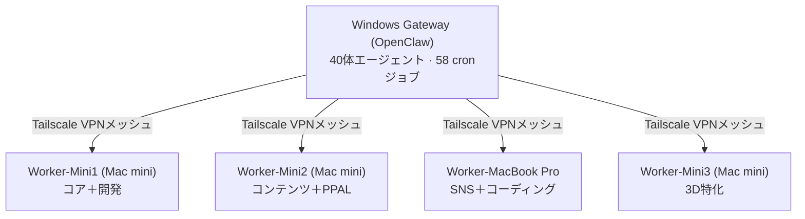

🌐 **[English](./README.md)** | 🇯🇵 **日本語**

---

## ストーリー

**2024年** — プロンプト1本から始めた。エンジニアの学位なし。ノートPCと好奇心だけ。

**2025年** — 5台のマシン上に40体の自律AIエージェントを構築。コード生成、コミュニティ運営、コンテンツ制作、経営管理を24時間365日こなす。

**2026年4月** — **合同会社みやび**を愛知県一宮市で設立。人間1人。AIエージェント40体。本物の会社を回す。

> *「自分はコードを書かない。AIがコードを書くシステムを設計する。」*

---

## オープンソースへの貢献 (OSS Contributions)

| プロジェクト | 説明 | コントリビューション |
|------|------|------|
| 🧠 **[GitNexus](https://github.com/abhigyanpatwari/GitNexus)** | コードベース知識グラフ (18K+ ⭐) | **[10 PRs Merged](https://github.com/abhigyanpatwari/GitNexus/pulls?q=is%3Apr+author%3AShunsukeHayashi+is%3Aclosed)**. Pythonモジュール解析、インパクト分析のスケーリング、CLIツールのコアバグ修正など。 |
| 🏰 **[Miyabi](https://github.com/ShunsukeHayashi/Miyabi)** | 自律型AI開発フレームワーク | 自社の40体エージェントクラスターを稼働させているフレームワークのアーキテクト兼メインテナー。 |

---

## 数字で見る実績

| | |
|---|---|
| 🤖 **40体のAIエージェント** | 5台のマシンで24時間稼働 |
| ⏰ **58本のcronジョブ** | 自動化されたビジネスオペレーション |
| 📦 **68本のオリジナルリポ** | オープンソースのツール＆フレームワーク |
| ⭐ **400+ GitHub Stars** | 世界中で使われるオープンソースツール |
| 📊 **年間7,749コントリビューション** | GitHub活動量 上位0.1% |
| 🐦 **38,000+ Xフォロワー** | [@The_AGI_WAY](https://x.com/The_AGI_WAY) |
| 🎓 **981件の取引実績** | [Teachable 9コース](https://shuhayas-s-school.teachable.com) |
| 📝 **5,447 noteフォロワー** | AI教育コンテンツ |

---

## エージェント・アーキテクチャ

**エージェントの仕事:**
- 🤖 **Discord** — 14体のAIキャラクターがコミュニティを自律運営
- 📝 **コンテンツ** — X投稿・note記事・Teachableコースの下書き生成
- 💻 **開発** — コード生成、PRレビュー、CI/CDデプロイ
- 📊 **経営** — 経費処理、KPIモニタリング、スケジュール管理
- 🔒 **セキュリティ** — 自動監査、ファイアウォール監視

---

## 方法論

| フレームワーク | 説明 |
|---------------|------|
| **ゴールシークプロンプトデザイン** | ゴールから逆算してAIエージェントの行動を設計する |
| **コンテキストエンジニアリング** | 階層型YAMLによるマルチエージェントコンテキスト管理 |
| **MISO** | Mission Inline Skill Orchestration — Telegram上の自律エージェントUI |
| **θ(シータ)サイクル** | 自己改善ループ: 観察→分析→判断→実行→検証→学習 |

---

## 技術スタック

### AI / LLM

### 言語

### インフラ

---

## ⭐ 代表プロジェクト

  
  

  
  

<b>📂 全68リポジトリをカテゴリ別に見る</b>

### AIエージェントフレームワーク (11)
miyabi-claude-plugins ⭐30 · Miyabi_AI_Agent ⭐29 · Miyabi ⭐16 · Auto-coder-agent ⭐16 · Dev_Claude ⭐7 · swml-agent ⭐3 · XinobiAgent_Devin ⭐3 · claude-agent-sdk ⭐2 · XinobiAgent ⭐2 · AI_entrepreneur_Agent ⭐1

### MCPサーバー (8)
context_engineering_MCP ⭐28 · rpgmaker-mz-mcp ⭐21 · miyabi-mcp-bundle ⭐5 · MCP ⭐4 · lark-wiki-mcp-agents ⭐4 · lark-openapi-mcp-enhanced ⭐4 · tyrano-studio-mcp ⭐2 · voicebox-mcp

### プロンプトエンジニアリング (5)
Shunsuke-style-PromptDesign ⭐21 · plugin-generator ⭐2 · hayashi-agent-prompt-generator ⭐1 · agent-context-study · sop-generator

### コミュニティ (4)
miso ⭐9 · a2a ⭐3 · miyabi-discord · LINE_Notification_discord ⭐1

### AIアプリケーション (7)
shunsuke-ultimate-ai-platform ⭐5 · shinyu-ai ⭐5 · AntiGravity_miyabi_edition ⭐3 · hanzo ⭐2 · ai-partner-app ⭐2 · agent-visionary-console ⭐2 · 3D_Tetris_Engine ⭐1

### OpenClawエコシステム (3)
openclaw-prod ⭐2 · MiyabiDash · voiceclaw

### 音声 (3)
byteplus-voice-ai ⭐1 · voicebox-tts · VoiceFlow

### ビジネス (4)
gas-executor ⭐7 · mastra-youtube-affiliate ⭐3 · Ad_generator ⭐2 · law-api-agent ⭐2

### 教育 / PPAL (4)
ppal-skill-library ⭐4 · how-to-use-miyabi ⭐4 · ppal-mcp-collection ⭐2 · teachable-webhook-aws ⭐1

### コンテンツ (3)
Notion-ChatGPT-streaming-connector ⭐1 · note_gen ⭐1 · zenn ⭐1

---

## GitHub統計

 

---

## コントリビューション

---

## 一緒に仕事しませんか？

| | |
|---|---|
| 🎓 **AI教育** | [Teachableコース](https://shuhayas-s-school.teachable.com) — 自律AIシステム構築を学ぶ |
| 💼 **法人のお客様** | [miyabi-ai.jp](https://www.miyabi-ai.jp) — AIエージェントアーキテクチャ・コンサルティング |
| 📩 **お問い合わせ** | [shunsuke.hayashi@miyabi-ai.jp](mailto:shunsuke.hayashi@miyabi-ai.jp) |
| 🐦 **フォロー** | [@The_AGI_WAY](https://x.com/The_AGI_WAY) — 毎日のAIインサイト |

---

**合同会社みやび** — 愛知県一宮市 / 2026年4月設立

*「AIと人間が共に働く世界を、自ら証明し、社会に届ける。」*

**Build** × **Operate** × **Educate**

